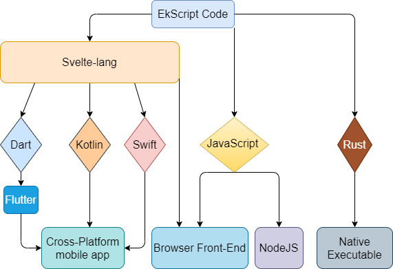

# EkScript

### Write Once Run Anywhere

EkScript is a TypeScript based programming language following the write-once-run-anywhere principle. EkScript can be used to build Front-end, Android, iOS, Desktop and ARM-based GUI apps. It also compiles to Rust to run your server-side applications as executable.

EkScript doesn't compile to anything. EkScript compiler is basically a transpiler with an interpreter. It transpiles EkScript code to JavaScript, Java, Swift and Rust letting you create GUIs with ease. EkScript Dev mode also runs an interpreter for faster development cycles.

## Why another programming language?

1. Native code is always the best. For web its JavaScript/WebAssembly. For Android its Java/Rust. For iOS its Swift/Rust. For Desktop applications its Rust. For CLI its native executables. EkScript simply transpiles into these platform specific code to give you the best experience developing applications with an awesome interop.
2. EkScript's development mode is an interpreter. So, you don't have for the code to wait.
3. EkScript lets you write truly Native GUI applications for Web, Android, iOS, Desktop and ARM-based with a single pattern that is similar to Svelte. One pattern for everything.
4. EkScript's production mode is a compiler that compiles code to the respective platform.
5. The BEST part is the interop. EkScript's interop with other programming languages is through a simple `*.d.es` definition file like in TypeScript. It's that simple.
6. EkScript has many more features. Astras in EkScript will support native transpilation to other programming language.

## EkScript Code Diagram:

## What's included?

1. EkScript module bundler with Live-reload feature for all the platforms EkScript targets. The module bundler includes template for SSR rendering. SSR Rendering with in-built 